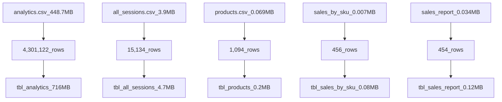

# Final-Project-Statistical-Modelling-with-Python

## Project/Goals
(fill in your description and goals here)

## Process
### 1. Data Collection

### (your step 2)

## Results
(fill in what you found about the comparative quality of API coverage in your chosen area and the results of your model.)

## Challenges 
(discuss challenges you faced in the project)

## Future Goals
(what would you do if you had more time?)
