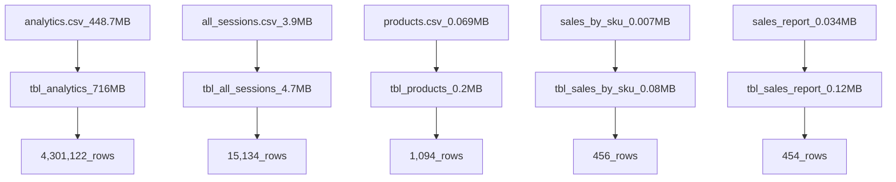
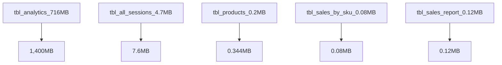

# Final-Project-Transforming-and-Analyzing-Data-with-SQL

## Project/Goals
Create an efficient PostgreSQL database for ecommerce data files and clean in preparation for analysis.

## Process
1. Import data from 5 CSV files.  General plan created in [my excel datatype creation planning](https://github.com/cboyda/LighthouseLabs/blob/d0147fb2b966ad36100ef3ce7e7dfc24b628d9b3/Project-SQL/SQL%20Data%20Files/data%20types.xlsx)
2. PostgreSQL Tables created to store analytics(4,301,122 rows), all_sessions(15,134 rows), products(1,092), sales_by_sku(462 rows), sales_report(454 rows) Full details of exact SQL to create and clean data available [full project1-postgressql.sql](https://github.com/cboyda/LighthouseLabs/blob/d0147fb2b966ad36100ef3ce7e7dfc24b628d9b3/Project-SQL/project1-postgresql.sql)
3. SQL [Data Cleaning](https://github.com/cboyda/LighthouseLabs/blob/d4e420e83e65acdc3082fb29f076e9b30d1b32d9/Project-SQL/cleaning_data.md) which resulted in products(+2 new rows) and sales_by_sku(-6 unmatched rows)
4. Document any [Quality Assurance (QA)](https://github.com/cboyda/LighthouseLabs/blob/d4e420e83e65acdc3082fb29f076e9b30d1b32d9/Project-SQL/QA.md) notes.
5. Answer questions from the data generated including [part 3: starting with questions](https://github.com/cboyda/LighthouseLabs/blob/d0147fb2b966ad36100ef3ce7e7dfc24b628d9b3/Project-SQL/starting_with_questions.md) and [part 4: starting with data](https://github.com/cboyda/LighthouseLabs/blob/d0147fb2b966ad36100ef3ce7e7dfc24b628d9b3/Project-SQL/starting_with_data.md)



Note: The CSV's were too large to upload to Github with the current max of 100MB.

## Results
(fill in what you discovered this data could tell you and how you used the data to answer those questions)

1. This data needed to be manually screened prior to being imported.  
* For example in all_sessions.pagetitle on row 448 of the csv the length of characters is 576 characters.  
Statistical Analysis of the length of all page titles shows:

| Statistic         | Value             |
| ----------------- | ----------------- |
| Mean              | 35.00330382       |
| Standard Error    | 0.14942259        |
| Median            | 40                |
| Mode              | 50                |
| Standard Deviation| 18.38201537       |
| Sample Variance   | 337.8984891       |
| Kurtosis          | 48.12838995       |
| Skewness          | 1.209987756       |
| Range             | 576               |
| Minimum           | 0                 |
| Maximum           | 576               |
| Sum               | 529740            |
| Count             | 15134             |


This (576 length) is a HUGE outlier and also irrelevant information since the page title is not included in the querystring.
Original pagetitle field:
```
weixin://private/setresult/SCENE_FETCHQUEUE&eyJmdW5jIjoibG9nIiwicGFyYW1zIjp7Im1zZyI6Il9ydW5PbjNyZEFwaUxpc3QgOiBtZW51OnNoYXJlOnRpbWVsaW5lLG1lbnU6c2hhcmU6YXBwbWVzc2FnZSxvblZvaWNlUmVjb3JkRW5kLG9uVm9pY2VQbGF5QmVnaW4sb25Wb2ljZVBsYXlFbmQsb25Mb2NhbEltYWdlVXBsb2FkUHJvZ3Jlc3Msb25JbWFnZURvd25sb2FkUHJvZ3Jlc3Msb25Wb2ljZVVwbG9hZFByb2dyZXNzLG9uVm9pY2VEb3dubG9hZFByb2dyZXNzLG1lbnU6c2V0Zm9udCxtZW51OnNoYXJlOndlaWJvLG1lbnU6c2hhcmU6ZW1haWwsd3hkb3dubG9hZDpzdGF0ZV9jaGFuZ2UsaGRPbkRldmljZVN0YXRlQ2hhbmdlZCxhY3Rpdml0eTpzdGF0ZV9jaGFuZ2UifSwiX19tc2dfdHlwZSI6ImNhbGwiLCJfX2NhbGxiYWNrX2lkIjoiMTAwMCJ9
```
shortened to
```
weixin://private/setresult/SCENE_FETCHQUEUE
```
Since & and anything after is not needed for pagetitle information, and the URL still works!
Once cleaned `pagetitle` nicely fit into a much smaller varchar field.

2. Exercised FIND, FIX, FUTURE PROOF ideology to ensure when bugs in data found and fixed additional constraints were added to minimize future reoccurence.  See process #3 on [part 5: QA your data steps](https://github.com/cboyda/LighthouseLabs/blob/d4e420e83e65acdc3082fb29f076e9b30d1b32d9/Project-SQL/QA.md)

3. A full work in progress of all test queries can also be found at [work in progress SQL](https://github.com/cboyda/LighthouseLabs/blob/2a1a09f69327dc01f80027cfa3d9252c2559d96f/Project-SQL/SQL%20Data%20Files/data%20cleaning%20on%20ecommerce%20may%2014.sql)

Schema generated from PG Admin4:


## Challenges 
(discuss challenges you faced in the project)

1. The first challenge was that pg admin4 did a poor job of uploading csv data into Amazon AWS RDS PostgreSQL.
    * GUI import failed
    * psql command lines failed
    * COPY is not available
    * \copy was too limited

    My solution was to find and use other tools to complete the necessary upload, [DBeaver](https://dbeaver.io/) turned out to be an excellent product.

2. The second challenge was non-standard tables and duplicate information really requires input from a subject matter expert to explain the data:
    * why is the same information (totals) repeated in sales_by_sku and sales_report
    * there is multiple information that seems to be in the wrong tables, for example why is product category in all_sessions instead of products
    * For an example see step #13 in [part 2: data cleaning](https://github.com/cboyda/LighthouseLabs/blob/d4e420e83e65acdc3082fb29f076e9b30d1b32d9/Project-SQL/cleaning_data.md)

3. Found some of the required data cleaning to be something I would not agree with or do normally, especially in regards to money data formats and datatype storage choices.  See step #0 in [part 2: data cleaning](https://github.com/cboyda/LighthouseLabs/blob/d4e420e83e65acdc3082fb29f076e9b30d1b32d9/Project-SQL/cleaning_data.md)

## Future Goals
(what would you do if you had more time?)

1. Consult a subject matter expert (SME) to better understand the goals and data.  THEN columns/tables can be **dropped**.
2. Redo the data export of the CSV so that the data/columns are in the correct tables.
3. Minimize duplicate data in the CSV files PRIOR to importing into the database.
4. Enforce data integrity throughout ALL steps.  There are productSKUs that are missing in the product table, perhaps this needs DELETE/ALTER CASCADE constraints added to other parts of another database?
5. Optimization. Ultimate efficiency would be to minimize wasted resources.  Especially with 4million + rows.  Instead of generic NUMERIC declaration, NUMERIC(12,2) would save considerable space.  Once exercise was completed my database size results showed large size modifications


Total time: 25 hours

    For curiousity, AWS RDS PostgreSQL v15.2 costs to complete this project was less than $2 and allowed me to 
    leverage the speed and power of cloud database services (db.t3.micro with 2 x vCPU 1GB of RAM and max 20 GB storage)!

